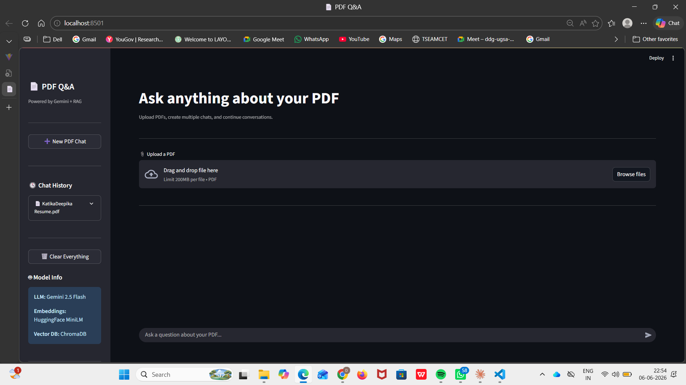
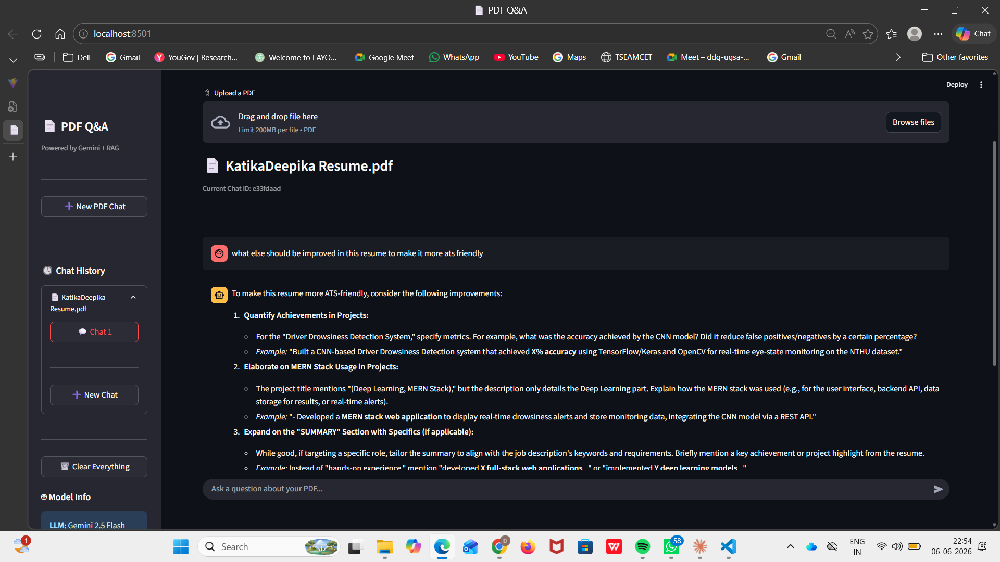

# 📄 RAG PDF Q&A System with Multi-Chat Memory

An intelligent Retrieval-Augmented Generation (RAG) application that allows users to upload PDF documents, ask natural language questions, and receive context-aware answers powered by Google Gemini and ChromaDB.

The system supports:

- PDF Upload & Automatic Indexing
- Multi-PDF Management
- Multiple Chats per PDF
- Persistent Chat History
- Semantic Search using Vector Embeddings
- Context-Aware Responses using Gemini
- Clean Streamlit User Interface

---

## 🚀 Features

### 📑 PDF Upload & Indexing

- Upload PDF documents directly through the UI
- Automatic text extraction and chunking
- Automatic vector indexing into ChromaDB
- No manual indexing required

---

### 🔍 Retrieval-Augmented Generation (RAG)

The system follows a complete RAG pipeline:

1. Extract text from PDF
2. Split into chunks
3. Generate embeddings
4. Store vectors in ChromaDB
5. Retrieve relevant chunks
6. Send retrieved context to Gemini
7. Generate accurate answers

---

### 🤖 AI-Powered Question Answering

- Powered by Google Gemini 2.5 Flash
- Context-aware responses
- Supports inference-based answers
- Maintains conversation continuity

---

### 💬 Multi-Chat Support

Each uploaded PDF can have:

- Chat 1
- Chat 2
- Chat 3
- ...

Users can create multiple conversations for the same PDF.

---

### 📂 Multi-PDF Support

The application stores separate sessions for:

- Resume.pdf
- ResearchPaper.pdf
- Notes.pdf

Each PDF maintains its own chat history.

---

### 🧠 Persistent Memory

Chat history is permanently stored and remains available even after:

- Restarting the backend
- Restarting Streamlit
- Closing the application

---

### 🎨 Modern User Interface

Built using Streamlit with:

- Clean dark theme
- ChatGPT-style conversation view
- PDF management sidebar
- Chat history navigation

---

## 🏗️ System Architecture

```

PDF Upload
↓
PDF Loader
↓
Text Chunking
↓
Embedding Generation
↓
ChromaDB Vector Store
↓
Retriever
↓
Gemini 2.5 Flash
↓
Answer Generation

```

---

## 🛠️ Tech Stack

### Frontend

- Streamlit

### Backend

- FastAPI

### LLM

- Google Gemini 2.5 Flash

### Embeddings

- HuggingFace MiniLM
- all-MiniLM-L6-v2

### Vector Database

- ChromaDB

### PDF Processing

- PyPDF

### Language

- Python

---

## 📁 Project Structure

```text
rag-qa-system/
│
├── backend/
│   ├── app/
│   │   ├── config.py
│   │   ├── memory.py
│   │   ├── pdf_loader.py
│   │   ├── rag_engine.py
│   │   ├── routes.py
│   │   └── vector_store.py
│   │
│   ├── uploads/
│   ├── main.py
│   └── requirements.txt
│
├── frontend/
│   ├── utils/
│   │   └── api_client.py
│   └── app.py
│
├── chroma_db/
├── .env
├── .gitignore
└── README.md
```

---

## ⚙️ Installation

### 1. Clone Repository

```bash
git clone https://github.com/yourusername/rag-qa-system.git

cd rag-qa-system
```

### 2. Create Virtual Environment

```bash
python -m venv venv
```

### 3. Activate Virtual Environment

Windows:

```bash
venv\Scripts\activate
```

Linux/Mac:

```bash
source venv/bin/activate
```

---

### 4. Install Dependencies

```bash
pip install -r requirements.txt
```

---

### 5. Configure Environment Variables

Create a `.env` file:

```env
GEMINI_API_KEY=YOUR_GEMINI_API_KEY
```

Get your API key from:

https://aistudio.google.com/

---

## ▶️ Running the Application

### Start Backend

```bash
cd backend

py -m uvicorn main:app --reload --port 8000
```

---

### Start Frontend

```bash
cd frontend

streamlit run app.py
```

---

## 🧪 Example Questions

### Resume Analysis

- What role best suits this resume?
- What are the candidate's strongest skills?
- Suggest career improvements.

### Research Papers

- Summarize this paper.
- What is the main contribution?
- Explain the methodology.

### Notes & Study Material

- Give important points.
- Create interview questions.
- Generate a summary.

---

## 📸 Screenshots

Add screenshots here:

### Home Page



### PDF Upload & Chat Interface



---

## 🔮 Future Enhancements

- User Authentication
- PDF Preview Panel
- Source Highlighting
- Citation-Based Answers
- Voice Input
- Voice Responses
- Cloud Storage Support
- Multi-User Support
- MongoDB Integration
- Chat Export (PDF/Word)

---

## 👩‍💻 Author

**Deepika Katika**

B.Tech Computer Science Engineering

Artificial Intelligence & Machine Learning Enthusiast

GitHub: https://github.com/Deepika471

LinkedIn: https://linkedin.com/in/deepika-katika-2k5

---

## 📄 License

This project is developed for educational and research purposes.
